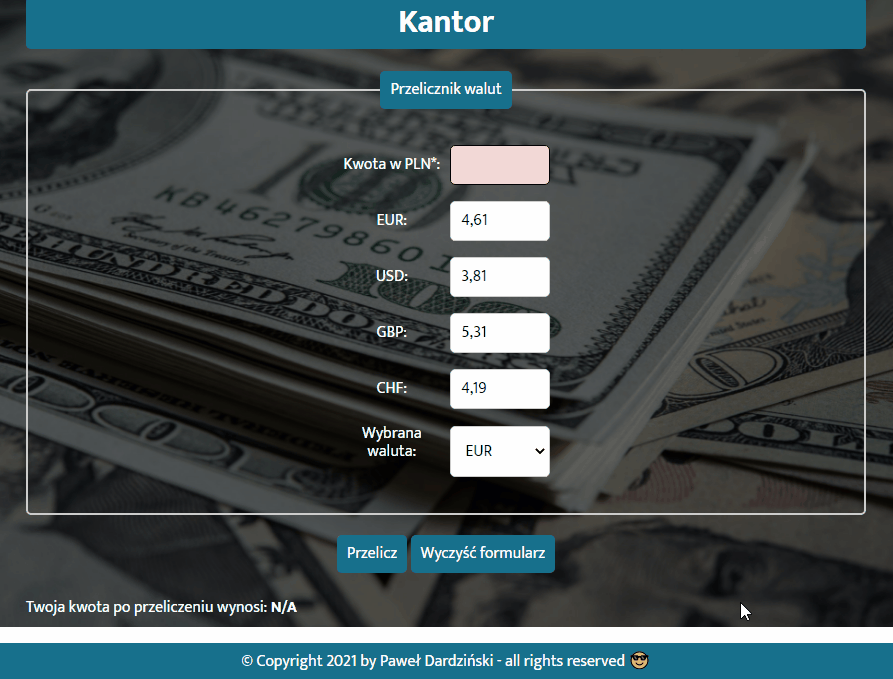

# Paweł Dardziński - homepage
## Table of content:
1. Description
2. Short review
3. Demo
4. How to use
5. Used features:
## Description
I created a simple currency converter. You can enter the PLN amount and select the type and currency to which you want to convert the PLN amount. There are currently 4 currencies available (EUR, USD, GBP, CHF). Each of them has its own conversion factor. The conversion rate of each currency can be edited. After pressing the "Convert" button, the amount is converted and displayed in the appropriate field at the bottom of the screen. Using the "Clear form" button, we clear the result and the entered amount.
## Short review

## Demo:
https://pawel-frontend.github.io/currency-converter/
## How to use:

## Used features:
- Semantic HTML
- CSS
- ES6+ features
- BEM naming
## Author: Paweł Dardziński
